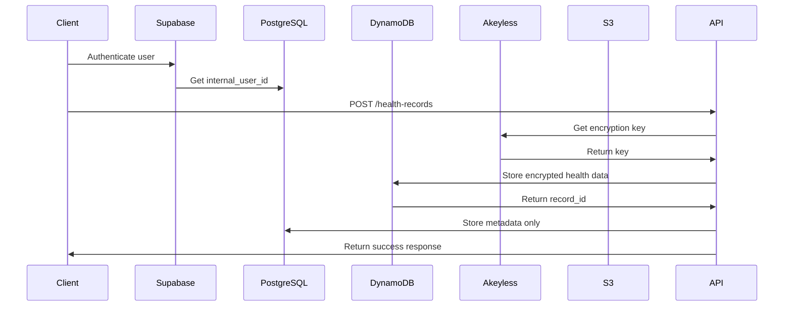
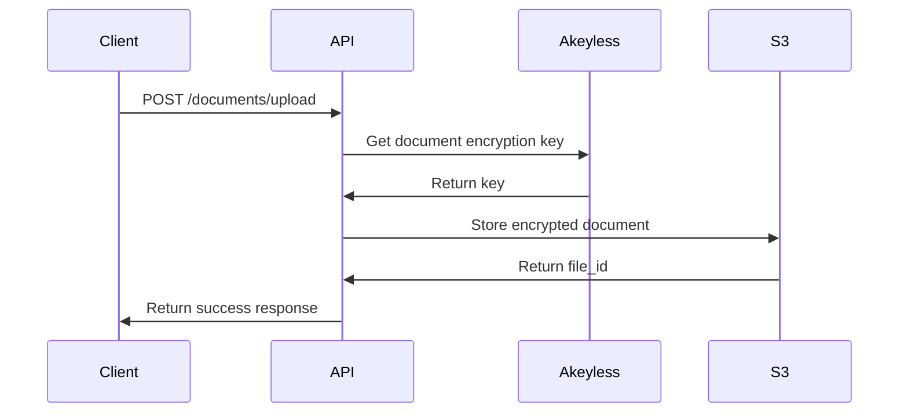

# Data Flow Architecture - YourHealth1Place

This document explains the correct data flow architecture for handling sensitive healthcare data securely.

## 🎯 **Correct Data Flow Overview**

The application follows a secure multi-service architecture where each service has a specific responsibility:

### **1. Supabase - Authentication & Light Data**
```
✅ Handles:
- User authentication (email/password, OAuth)
- Personal information (name, contact details, emergency contacts)
- Lightweight metadata (user settings, preferences, non-sensitive profile data)
- Internal user_id for secure cross-service linkage
```

### **2. AWS DynamoDB - Sensitive Health Data**
```
✅ Handles:
- Lab reports and test results
- Wearable device metrics
- AI-generated health summaries
- All sensitive health data with encryption
```

### **3. AWS S3 - Document Storage**
```
✅ Handles:
- User uploaded documents (PDFs, images)
- Medical reports and scans
- Encrypted file storage
```

### **4. Akeyless (AKS) - Encryption Key Management**
```
✅ Handles:
- All encryption keys for Supabase and AWS
- Secure key retrieval (no hardcoded keys)
- Complete audit logging for compliance
```

### **5. Internal PostgreSQL - Linkage & Metadata**
```
✅ Handles:
- User linkage between Supabase and AWS
- Non-sensitive metadata and audit trails
- Operational data (no sensitive health data)
```

## 🔄 **Data Flow Examples**

### **Example 1: Creating a Health Record**



**Code Flow:**
```python
# 1. User authenticated via Supabase
current_user = supabase_client.get_current_user()

# 2. Store sensitive data in DynamoDB
dynamodb_record_id = await dynamodb_service.store_health_data(
    internal_user_id=current_user.internal_user_id,
    data_type="lab_results",
    data=sensitive_health_data
)

# 3. Store metadata in PostgreSQL
db_health_record = HealthRecord(
    patient_id=patient_id,
    record_date=record_date,
    record_type="lab_results",
    dynamodb_record_id=dynamodb_record_id,  # Link to DynamoDB
    is_abnormal=False,
    requires_follow_up=False
)
```

### **Example 2: Uploading a Document**



**Code Flow:**
```python
# 1. Upload document to S3
file_id = await aws_service.store_document(
    internal_user_id=current_user.internal_user_id,
    file_data=file_data,
    file_name=file.filename,
    content_type=file.content_type
)
```

## 🛡️ **Security Architecture**

### **Data Separation**

| Service | Data Type | Encryption | Purpose |
|---------|-----------|------------|---------|
| **Supabase** | Auth & Personal Info | Supabase encryption | User management |
| **DynamoDB** | Sensitive Health Data | Akeyless + AWS KMS | Health records |
| **S3** | Documents & Files | Akeyless + AWS KMS | File storage |
| **PostgreSQL** | Metadata & Linkage | Database encryption | Operational data |
| **Akeyless** | Encryption Keys | Akeyless encryption | Key management |

### **Key Security Principles**

1. **No Sensitive Data in PostgreSQL**: Only metadata and linkage information
2. **Encryption at Rest**: All sensitive data encrypted with Akeyless keys
3. **Encryption in Transit**: TLS for all communications
4. **Access Logging**: Complete audit trail for compliance
5. **Key Rotation**: Automatic key rotation via Akeyless
6. **Least Privilege**: Minimal access permissions for each service

## 📊 **Data Storage Breakdown**

### **Supabase Stores:**
```json
{
  "users": {
    "id": "supabase_user_id",
    "email": "user@example.com",
    "name": "John Doe",
    "phone": "+1234567890",
    "emergency_contact": "Jane Doe"
  },
  "user_settings": {
    "user_id": "supabase_user_id",
    "preferences": {...},
    "notifications": {...}
  }
}
```

### **DynamoDB Stores:**
```json
{
  "record_id": "uuid",
  "internal_user_id": "internal_id",
  "data_type": "lab_results",
  "encrypted_data": {
    "blood_pressure": "120/80",
    "cholesterol": "200",
    "glucose": "95"
  },
  "encryption_key_id": "health-data-lab_results",
  "created_at": "2024-01-01T00:00:00Z"
}
```

### **S3 Stores:**
```
/documents/{internal_user_id}/{file_id}/{filename}
- Lab report PDFs
- Medical images
- Scanned documents
- All encrypted with Akeyless keys
```

### **PostgreSQL Stores:**
```sql
-- Only metadata, no sensitive data
CREATE TABLE health_records (
    id SERIAL PRIMARY KEY,
    patient_id INTEGER,
    record_date TIMESTAMP,
    record_type VARCHAR(50),
    dynamodb_record_id VARCHAR(255),  -- Link to DynamoDB
    is_abnormal BOOLEAN,
    requires_follow_up BOOLEAN,
    created_at TIMESTAMP
);
```

## 🔗 **Service Linkage**

### **User ID Flow:**
```
1. Supabase Auth → internal_user_id (never exposed)
2. internal_user_id → DynamoDB records
3. internal_user_id → S3 documents
4. internal_user_id → PostgreSQL metadata
```

### **Data Retrieval Flow:**
```
1. Authenticate via Supabase
2. Get internal_user_id from PostgreSQL
3. Query DynamoDB with internal_user_id
4. Decrypt data with Akeyless keys
5. Return combined metadata + sensitive data
```

## 🚨 **Compliance Features**

### **HIPAA Compliance:**
- ✅ **Encryption at Rest**: All sensitive data encrypted
- ✅ **Encryption in Transit**: TLS for all communications
- ✅ **Access Controls**: Role-based access control
- ✅ **Audit Logging**: Complete access trail
- ✅ **Data Retention**: 7-year retention policies
- ✅ **Backup & Recovery**: Automated backup procedures

### **GDPR Compliance:**
- ✅ **Data Minimization**: Only necessary data stored
- ✅ **Right to Erasure**: Complete data deletion
- ✅ **Data Portability**: Export capabilities
- ✅ **Consent Management**: User consent tracking

## 🔧 **Implementation Notes**

### **Environment Variables:**
```bash
# Supabase (Auth & Light Data)
SUPABASE_URL=https://your-project.supabase.co
SUPABASE_ANON_KEY=your-supabase-anon-key

# AWS (Sensitive Health Data)
AWS_ACCESS_KEY_ID=your-aws-access-key
AWS_SECRET_ACCESS_KEY=your-aws-secret-key
AWS_DYNAMODB_TABLE=yourhealth1place-health-data
AWS_S3_BUCKET=yourhealth1place-documents

# Akeyless (Encryption Keys)
AKEYLESS_ACCESS_ID=your-akeyless-access-id
AKEYLESS_ACCESS_KEY=your-akeyless-access-key
```

### **Key Management:**
```python
# Get encryption key from Akeyless
encryption_key = await akeyless_service.get_secret("health-data-lab_results")

# Encrypt sensitive data
encrypted_data = encrypt_data(sensitive_data, encryption_key)

# Store in DynamoDB
dynamodb.put_item(Item={
    'record_id': record_id,
    'internal_user_id': internal_user_id,
    'encrypted_data': encrypted_data
})
```

## 📈 **Benefits of This Architecture**

1. **Security**: Sensitive data never stored in PostgreSQL
2. **Scalability**: DynamoDB scales automatically
3. **Compliance**: Built-in HIPAA/GDPR compliance
4. **Cost Efficiency**: Pay only for what you use
5. **Reliability**: AWS managed services with high availability
6. **Auditability**: Complete audit trail for compliance

## 🚀 **Next Steps**

1. **Deploy Infrastructure**: Use the Terraform configuration
2. **Set Up Akeyless**: Configure encryption keys
3. **Test Data Flow**: Verify end-to-end functionality
4. **Security Audit**: Review all security configurations
5. **Compliance Review**: Ensure HIPAA/GDPR compliance

This architecture ensures that sensitive health data is properly separated and secured while maintaining the functionality needed for a healthcare application. 